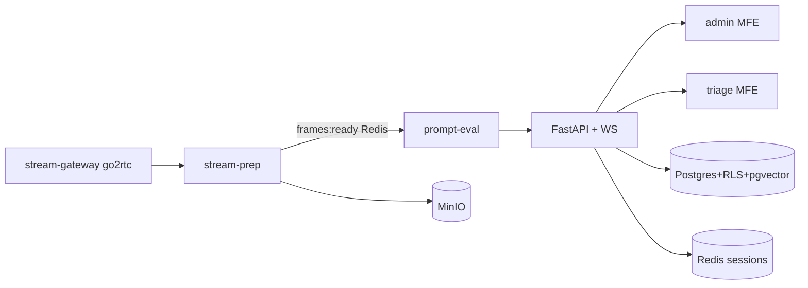

# Argus architecture

VERIFIED Vision pipeline → API → admin/triage MFEs. Product i18n: **en + pt-BR**.

## Live LLM

VERIFIED Live multimodal LLM calls run in **prompt-eval**. API LLM + Celery rank path is **unused** on the live triage path — see [known gaps](./known-gaps).
