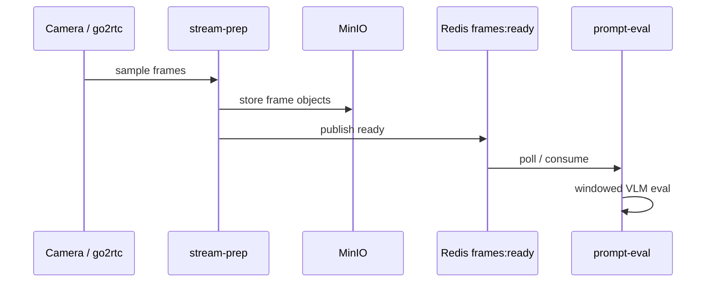

# Vision pipeline

```mermaid
sequenceDiagram
  participant Cam as Camera / go2rtc
  participant Prep as stream-prep
  participant M as MinIO
  participant R as Redis frames:ready
  participant PE as prompt-eval
  Cam->>Prep: sample frames
  Prep->>M: store frame objects
  Prep->>R: publish ready
  R->>PE: poll / consume
  PE->>PE: windowed VLM eval
```

| Knob | Default |
| --- | --- |
| `SAMPLE_FPS` | **1** |
| Window | **6** |
| Poll | **30s** |
| Detection confidence | **0.5** |
| VLM timeout | **60s** |
