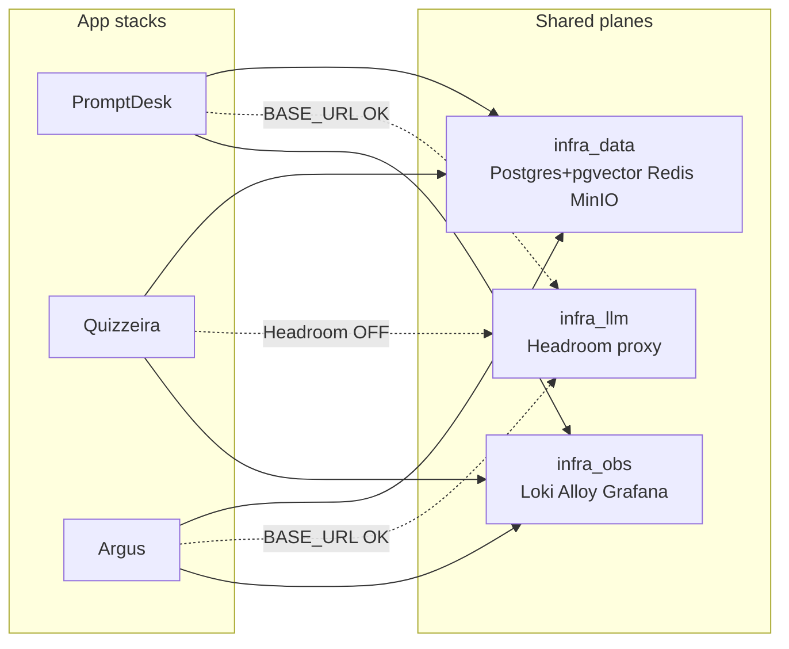

# Ecosystem overview

  
  
  

VERIFIED Three products share ops via the private **infra** repo (Jenkins on Hostinger) but have **no product API mesh** between them. LLM policy baseline lives in PromptDesk `docs/guardrails.md`.

| Product | Problem | Live surface |
| --- | --- | --- |
| **[PromptDesk](/en/promptdesk/architecture)** {width=20} | Multi-tenant AI customer support (admin SSO + support MFE) | `*.promptdesk.ferredemo.dev` |
| **[Quizzeira](/en/quizzeira/architecture)** {width=20} | Concurso study: ingest exams → generate bank → eval gate → study pills | `*.quizzeira.ferredemo.dev` |
| **[Argus](/en/argus/architecture)** {width=20} | Multi-company vision triage (camera → VLM → HITL) | `*.argus.ferredemo.dev` |

## Shared planes (infra)

| Plane | Role | Notes |
| --- | --- | --- |
| `infra_data` | Postgres (pgvector), Redis, MinIO | PromptDesk needs distinct roles `promptdesk` / `promptdesk_chat` |
| `infra_llm` | Headroom LLM proxy | VERIFIED Quizzeira workers set `LLM_USE_HEADROOM=false` |
| `infra_obs` | Loki (24h), Alloy, Grafana | Shared observability |

## Cross-cutting LLM defaults

VERIFIED where used:

- Provider order: **Gemini → OpenAI**
- Model rank refresh: **12h** (`MODEL_RANK_REFRESH_MS=43200000`)
- Canonical budgets: **20/min**, **500/day** (`LLM_RATE_LIMIT_PER_MINUTE` / `LLM_DAILY_BUDGET`)
- Headroom: Argus/PromptDesk via `GEMINI_BASE_URL` / `OPENAI_BASE_URL` OK; Quizzeira OFF by design

## How to read these docs

See [Status legend](/en/reference/status-legend). Claims that audits marked **NOT FOUND**, **PARTIAL**, or **UNUSED** are documented as gaps — not as shipping features.

## Start here

- [Guardrails standard](/en/standards/guardrails)
- [Comparison matrix](/en/reference/comparison-matrix)
- [Defaults cheatsheet](/en/reference/defaults-cheatsheet)
