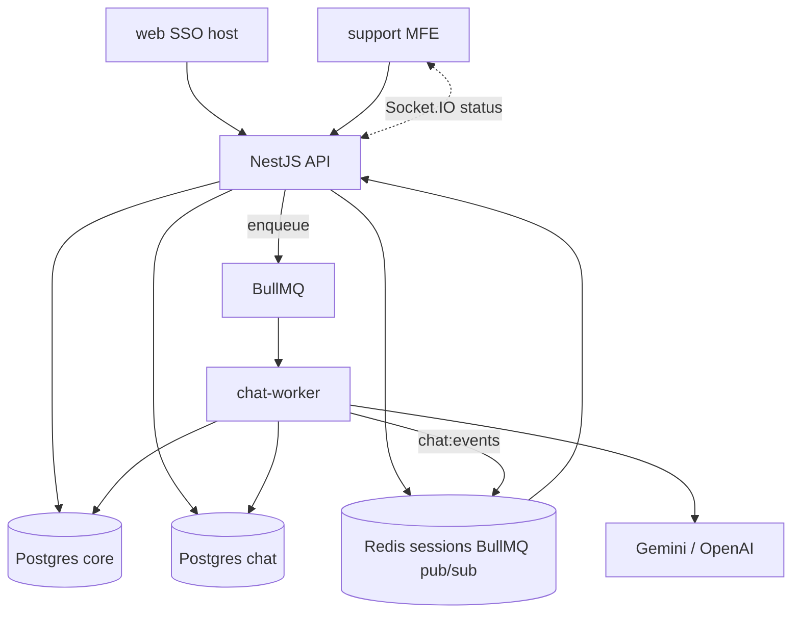

# PromptDesk architecture

VERIFIED NestJS API + BullMQ chat-worker + dual Postgres + Redis + Socket.IO status fan-out. Admin (web) and Support MFE are separate Vite apps.

## Processes

| Component | Role |
| --- | --- |
| `apps/api` | REST, Socket.IO gateway, dual Prisma, BullMQ producers |
| `apps/chat-worker` | Consumers → model ladder → persist → Redis events |
| `apps/web` / `apps/support` | Admin SSO host / support chat MFE |
| `apps/shared/auth` | Opaque session helpers + SSO return-origin allowlist |

## Data stores

- **Dual Postgres** — core (`prisma/`) vs chat (`prisma-chat/`); roles stay separate
- **Redis** — sessions (TTL **86400s**), BullMQ, pub/sub `chat:events`

## Trust

- Opaque Bearer session; tenant from **session**, not client claims
- `SSO_RETURN_ORIGINS` allow-list (open-redirect safe) — see [known gaps](./known-gaps) for client-only risk notes
