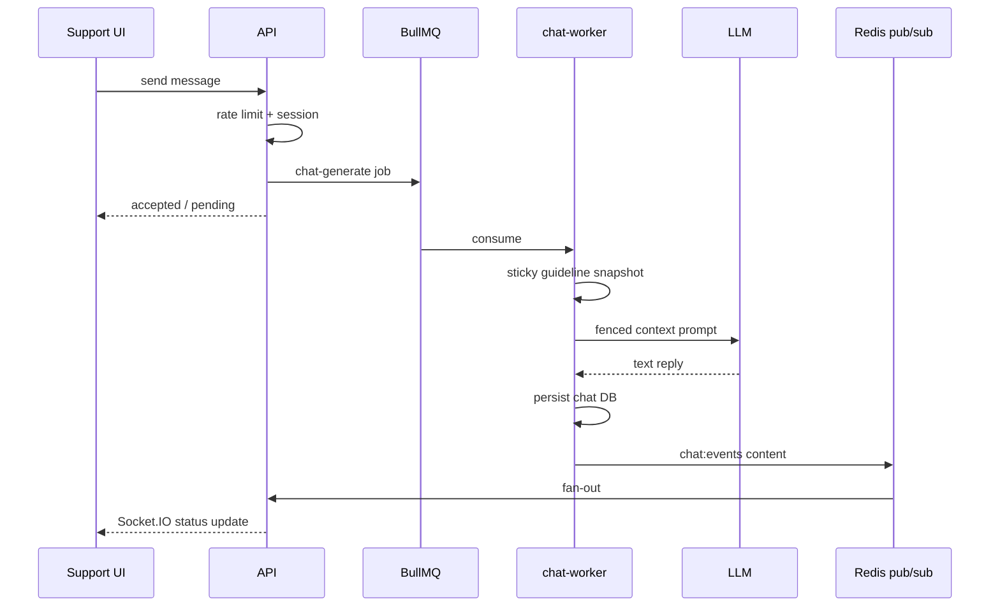

# Copilot flow

VERIFIED Interactive chat is **request → queue → worker → status**, not token streaming to the browser.

## Socket.IO semantics

VERIFIED Emits **job/status** (and event payload including assistant content via Redis) — **not** token streaming.

## Prompt construction

- System instructions from **registry** (`registry.yml`)
- Untrusted conversation + guidelines only in **fenced** user-message context
- Sticky snapshot: `versionId = hash` of resolved guideline version at job time
