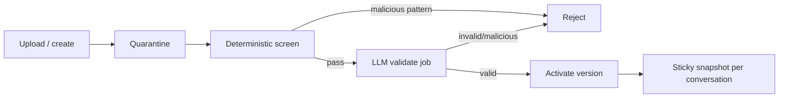

# Guidelines

VERIFIED Guidelines are versioned, hash-addressed, and quarantined until validation passes.

## Lifecycle

## Limits

| Control | Value | Notes |
| --- | --- | --- |
| `GUIDELINE_UPLOAD_LIMIT` | **10** | VERIFIED hardcoded in API companies service |
| Validation queue | `guideline-validate` | Worker + registry contracts |
| Sticky snapshot | `versionId=hash` | Conversation pinned to validated version |

## Security

- Pre-LLM `MALICIOUS_GUIDELINE_PATTERNS`
- Fail closed on unknown LLM verdicts
- Never log guideline bodies
