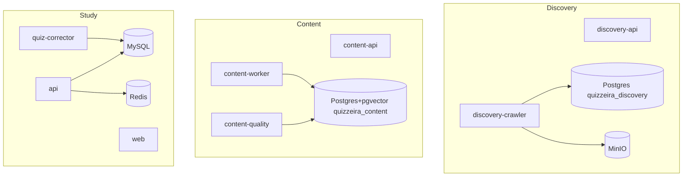

# Quizzeira architecture

VERIFIED Three planes: **Discovery**, **Content**, **Study**. Workers use **runLoop** intervals — not BullMQ.

## Intervals (defaults)

| Loop | Interval |
| --- | --- |
| Study / quality / corrector | **60s** |
| content-worker | **120s** |
| Crawler | **30m** |
| Source `intervalSec` | **1800** |
| Politeness delay | **1000ms** |

## LLM / Headroom

VERIFIED `LLM_USE_HEADROOM=false` — workers do not join Headroom without fixing network/auth (infra `docs/quizzeira-headroom.md`).

## Spec SoT

VERIFIED Crawler redesign SoT: `docs/crawler-redesign-spec.md` wins over `specs/001-crawler-redesign/spec.md` (Ralph compatibility only; **specs/001 missing** content parity).
