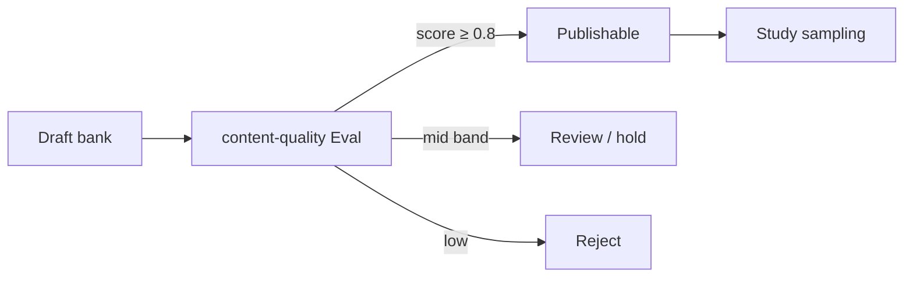

# Eval gate

VERIFIED Only Eval-approved items reach Study sampling.

| Threshold | Value |
| --- | --- |
| Pass / soft bands | **0.8 / 0.5** |
| Publish gate | Eval-approved only |

```mermaid
flowchart LR
  D[Draft bank] --> E[content-quality Eval]
  E -->|score ≥ 0.8| P[Publishable]
  E -->|mid band| R[Review / hold]
  E -->|low| X[Reject]
  P --> S[Study sampling]
```
