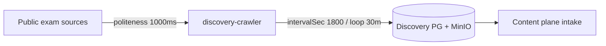

# Ingestion

VERIFIED Discovery crawler pulls public exam sources into Discovery Postgres + MinIO on a schedule.

## Defaults

| Knob | Value |
| --- | --- |
| Crawler loop | 30m |
| Source `intervalSec` | 1800 |
| Politeness | 1000ms |

## No bank seed

VERIFIED There is **no question-bank seed**. Seeds are users only. Bank fills via Ingestion → Content → Eval.
