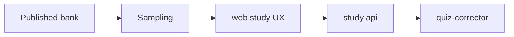

# Sampling & study

VERIFIED Study plane (MySQL + Redis) samples **Eval-approved** items into study pills; grading via `quiz-corrector` (60s loop).

User seed only — never fake curriculum fixtures.
