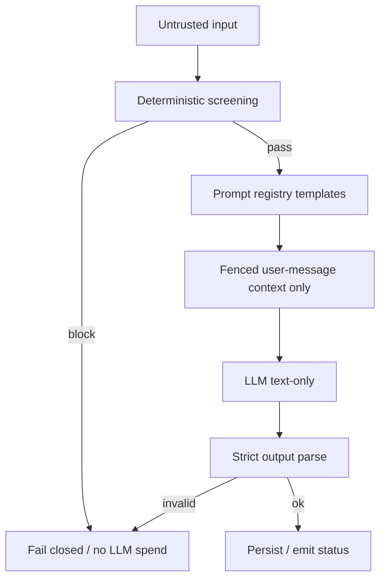

# Guardrails

VERIFIED PromptDesk `docs/guardrails.md` is the **baseline** for Argus and Quizzeira. Align contracts; do not weaken without an explicit task.

## Enforcement model

| Rule | Detail |
| --- | --- |
| Registry SoT | Prompts in versioned files (PromptDesk: `apps/chat-worker/prompts/registry.yml`) — not inline in code |
| Pre-LLM screen | Deterministic patterns before any model call |
| Trust boundary | Untrusted history/guidelines only inside **fenced** user-message context — never into system instructions |
| Fail closed | Unknown verdicts / contract violations are errors |
| Logging | Ids, statuses, models — **never** message/guideline bodies |
| Agency | Text-only LLM; no tools / no writes from the model |

## Provider policy

- Gemini-first; OpenAI optional failover
- Honor `LLM_PROVIDER_ORDER` (unknown names ignored; keyless providers skipped)
- Cross-provider failover only after all attempts on current provider fail

## OWASP LLM Top-10 (2026) highlights

| Risk | Enforcement note |
| --- | --- |
| LLM01 Prompt Injection | Fenced context; guideline quarantine + validator |
| LLM02 Sensitive Disclosure | No secrets in prompts; PARTIAL PromptDesk Redis `chat:events` carries reply text |
| LLM03 Excessive Agency | Text-only; no tools |
| LLM06 Unbounded Consumption | HTTP caps + worker minute/daily budgets |
| LLM09 Vector weaknesses | N/A for PromptDesk (no vector store); see product pages for Argus/Quizzeira |

## Product mapping

| Product | Guardrails home |
| --- | --- |
| PromptDesk | `docs/guardrails.md` (reference) |
| Argus | `docs/ai-engineering.md`, `apps/api/docs/guardrails.md` |
| Quizzeira | `docs/guardrails.md` |
