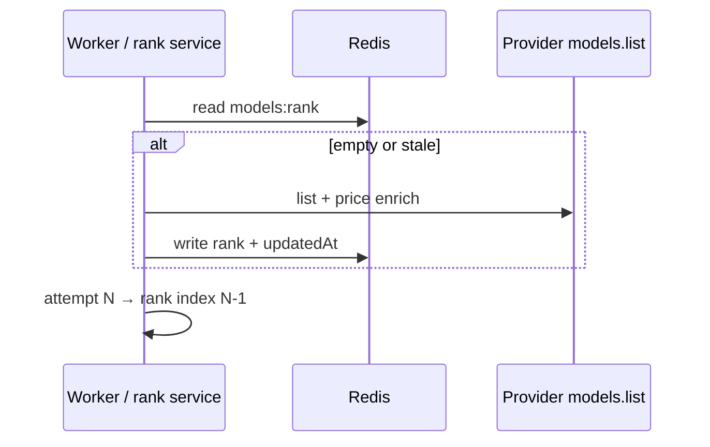

# Model ladder & budgets

VERIFIED Shared cheapest-model rank pattern (PromptDesk reference; Argus has rank code that is unused on the live path — see Argus gaps).

## Rank contract

| Knob | Default | Meaning |
| --- | --- | --- |
| `MODEL_RANK_TOP_N` | `3` | Only N cheapest models used |
| `MODEL_RANK_REFRESH_MS` | `43200000` (12h) | Redis rank refresh |
| Seeds + live list | provider-specific | Cached under `models:rank:{provider}` |

## Budgets

Canonical names for other projects:

| Variable | Typical strict default | Scope |
| --- | --- | --- |
| `LLM_RATE_LIMIT_PER_MINUTE` | **20** | Per-entity requests/minute |
| `LLM_DAILY_BUDGET` | **500** | Per-entity daily requests |
| HTTP send caps | product-specific | e.g. PromptDesk chat rate window |

Fail closed before provider calls when caps are exceeded.

## Headroom

| Product | Headroom |
| --- | --- |
| PromptDesk | OK via `*_BASE_URL` toward `infra_llm` |
| Argus | OK via `*_BASE_URL` |
| Quizzeira | VERIFIED **OFF** (`LLM_USE_HEADROOM=false`) — see infra `docs/quizzeira-headroom.md` |
