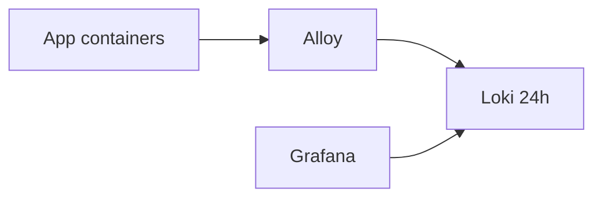

# Observability

VERIFIED Shared plane `infra_obs`: **Loki** (24h retention), **Alloy**, **Grafana**.

## Product notes

| Product | Logging policy |
| --- | --- |
| PromptDesk | No message/guideline body logs; ids/statuses/models only |
| Quizzeira | Align with Promptdesk-compatible guardrails |
| Argus | Log ids/statuses — not raw frame/prompt payloads |

## What is not claimed

NOT FOUND as a shared product mesh: distributed tracing product API, unified Prometheus app metrics contract, or cross-app APM. Ops visibility is primarily logs → Loki → Grafana.
