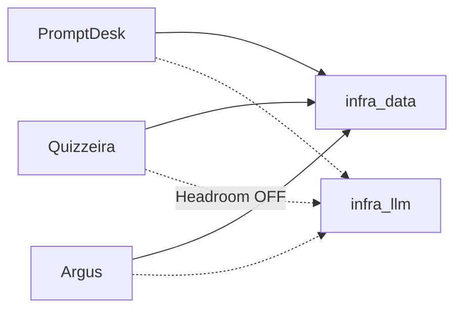

# Visão geral do ecossistema

VERIFIED Três produtos compartilham ops via o repositório privado **infra** (Jenkins na Hostinger), sem **malha de APIs** entre produtos. A linha de base de LLM está em PromptDesk `docs/guardrails.md`.

| Produto | Problema |
| --- | --- |
| **PromptDesk** | Suporte ao cliente com LLM (SSO admin + MFE support) |
| **Quizzeira** | Estudo para concursos: ingestão → banco → eval → pílulas |
| **Argus** | Triagem visual multi-empresa (câmera → VLM → HITL) |

## Planos compartilhados

- Ordem de provedores: **Gemini → OpenAI**
- Refresh de ranking: **12h**
- Orçamentos canônicos: **20/min**, **500/day**
- Quizzeira Headroom: **OFF**

Documentação completa em inglês: [/en/](/en/). Este `/pt` é o esqueleto i18n — páginas-chave abaixo; demais seções apontam para o EN até a tradução completa.
