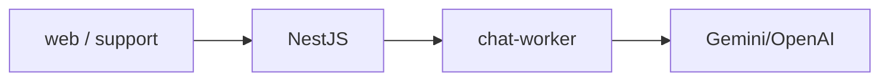

# Arquitetura PromptDesk

VERIFIED API NestJS + worker BullMQ + Postgres dual + Redis + Socket.IO de **status** (não streaming de tokens).

```mermaid
flowchart LR
  UI[web / support] --> API[NestJS]
  API --> W[chat-worker]
  W --> LLM[Gemini/OpenAI]
```

Detalhe: [English](/en/promptdesk/architecture).
